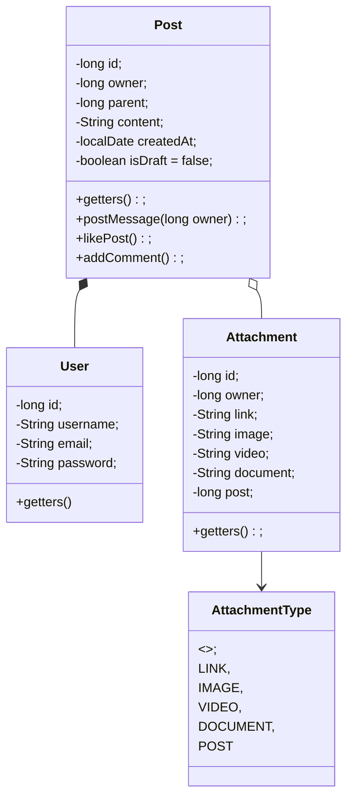

# simplon-miniature

Brief 06 - Développement d'une API pour le Réseau Social "Miniature"

## Diagramme de classes

```mermaid
classDiagram

class User {
-long id;
-String username;
-String email;
-String password;
+getters()
}

class Post {
-long id;
-long owner;
-long parent;
-String content;
-localDate createdAt;
-boolean isDraft = false;
+getters();
+postMessage(long owner);
+likePost();
+addComment();
}

class AttachmentType {
<<enumeration>>;
LINK,
IMAGE,
VIDEO,
DOCUMENT,
POST
}

class Attachment {
-long id;
-long owner;
-String link;
-String image;
-String video;
-String document;
-long post;
+getters();
}

Post *-- User
Post o-- Attachment
Attachment --> AttachmentType

```
